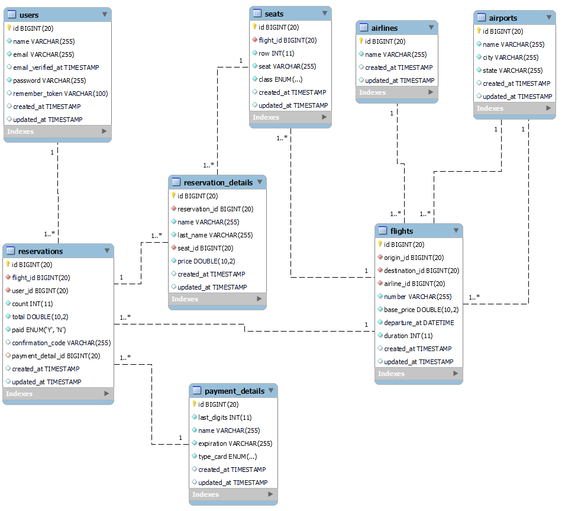

# MID FLIGHT
Esta es mi propuesta para la reserva y consultas de vuelos, este proyecto fue realizado con Laravel 9.19, Sactum 3.0, Mysql 14.14 y Php 9

## Diagrama


## Pasos de instalación
```
git clone https://github.com/gcupul/mid-flights.git
```

```
composer install
```

```
php artisan migrate
```

```
php artisan db:seed
```

Estos comandos crearan en automatico las tablas que se necesitan al igual que sus relaciones, de igual forma el ultimo comando crea una seria de registros en las tablas, <b>airports, airlines, flights y seats</b> para poder realizar pruebas directas.

## API Mid-flight

1. [POST] /api/register
2. [POST] /api/login
3. [GET] /api/airports
4. [POST] /api/flights
5. [POST] /api/seats
6. [POST] /api/reservation
7. [POST] /api/payReservation

Aqui puede encontrar la colección de postman para mas información.
[Postman collection](documentation/mid-flights-api.postman_collection.json)

### Pasos
1. Para poder seleccionar un origen o destino es necesario obtener los areopuertos y seleccionar el id que nos regresa la lista.
2. Con el airport_id de origen y destino se lo pasamos la consulta de vuelos como origin_id y destination_id para ver los vuelos disponibles.
3. Para reservar primero hay que seleccionar el o los asientos que desea.
4. Al reservar debe indicar seat_id de cada persona que se relacionara con la reserva, el flight_id, y la información de cada pasajero.
5. Para pagar la reserva debe indicar el flight_id, reservation_id y los datos de la tarjeta para realizar el pago, con esto le regresara un codigo de confirmación.
